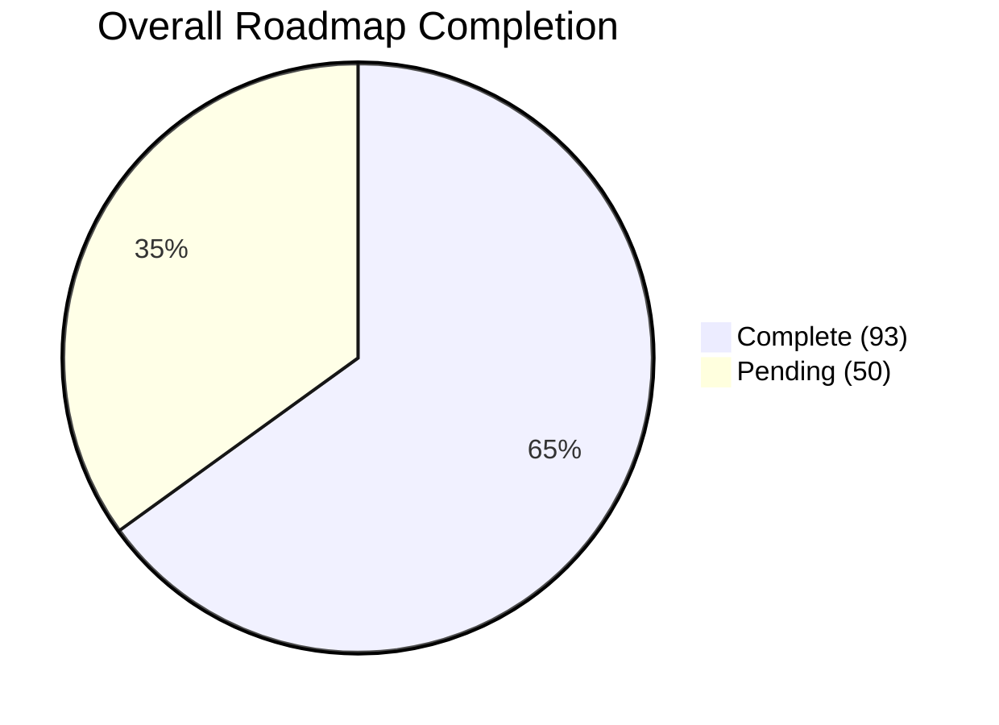
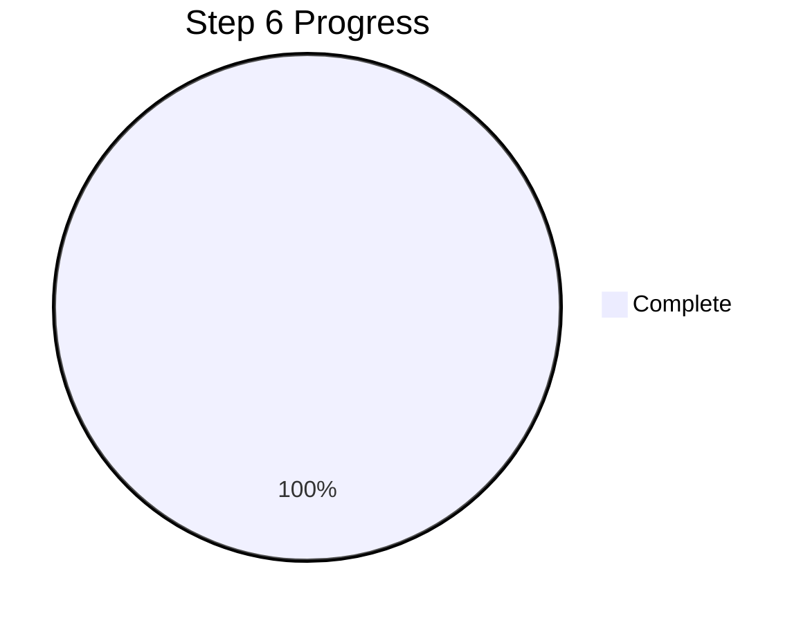
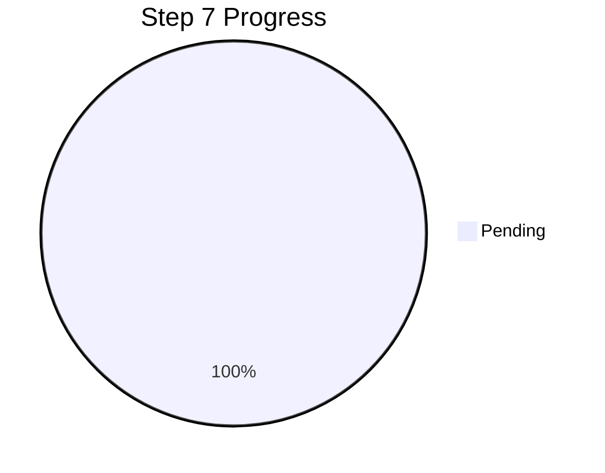
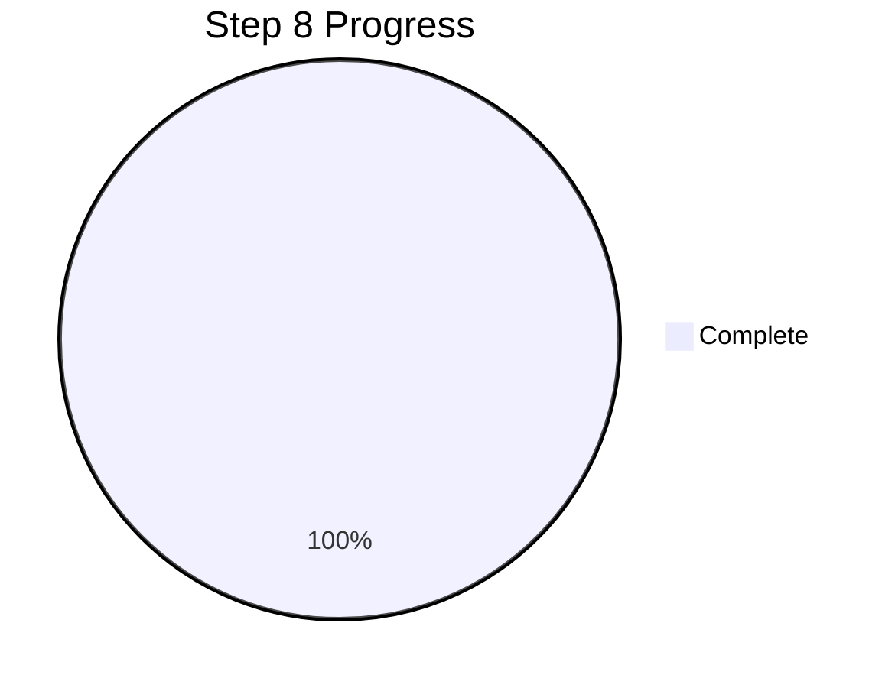
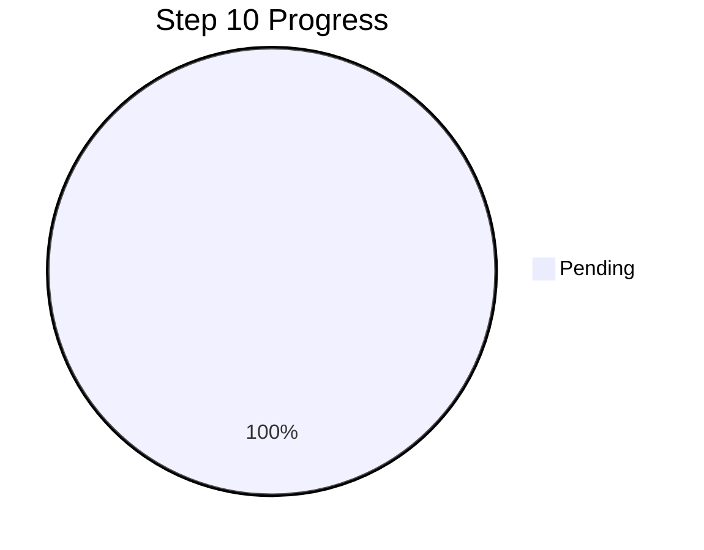
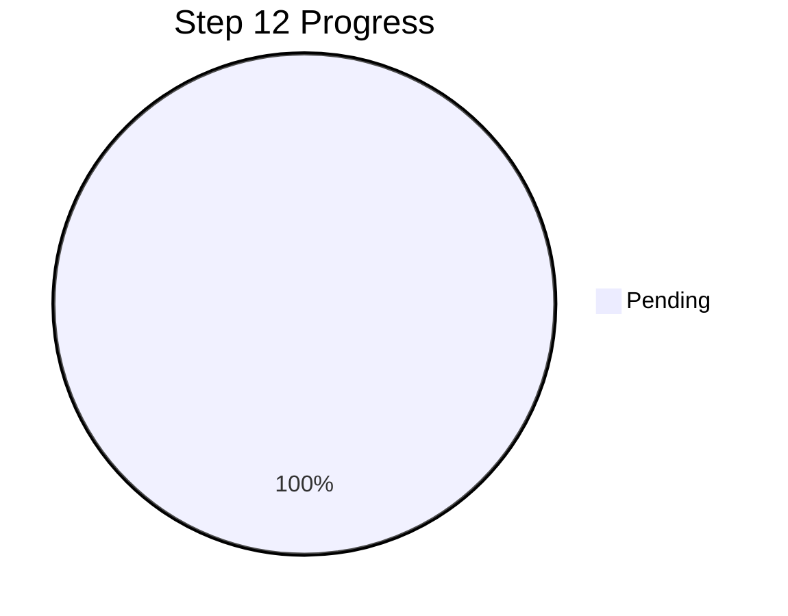

# COMPLETION REPORT
**Traceveil roadmap reconciliation, delivery status, and contribution record**

**Prepared:** 2026-09-06
**Source set:** Roadmap, frontend completion audit, batch-practical-usability-checklist, and updated contribution record.
**Repository snapshot:** Contribution history reviewed up to 2026-09-06.

## Executive Summary

**Project Delivery Status & Trajectory**

Traceveil has crossed a critical threshold in its development lifecycle, transitioning from core foundational services to an integrated, end-to-end operational platform. The system successfully demonstrates a robust **persisted batch-investigation workflow**, validated against rigorous usability showcases, alongside a newly finalized **Live IoT Integration pipeline** (Step 5). 

**Key Recent Achievements:**
- **Batch Processing Attained:** The system securely ingests, validates, and normalizes evidence into canonical events. The deterministic analysis engine is actively generating bounded risk scores, timelines, and analytical projections (Steps 3, 4, 6, and 8).
- **Live IoT Intake Established:** Authenticated HTTP intake, durable sessions, and controlled telemetry simulators are now fully implemented, bridging the gap between hardware sensors and our investigation backend (Step 5).
- **Usability Readiness:** The platform has passed the strict requirements of the *Batch Practical Usability Checklist*, meaning it is ready for the second-review university showcase.

**Overall Progress:**
Based on an accurate recount of the roadmap, exactly **93 of 143 planned sub-items** are completely implemented and verified, establishing a formal roadmap completion rate of **65.0%**. The final remaining focus areas are real-time frontend event delivery (Step 7), AI-powered visual/chat integrations (Steps 9 & 10), automated reporting (Step 11), and the conclusive physical demonstration (Step 12).

---

## Roadmap Completion by Area & Detailed Checklist

### 1. Initialization (Complete)

- [x] Set up React + Vite frontend
- [x] Set up FastAPI backend
- [x] Set up SQLite
- [x] Install required libraries
- [x] Connect frontend and backend
- [x] Add Ollama configuration and optional availability/model health checks
- [x] Install Ollama, pull the selected Qwen 9B Q4_K_M model, and verify it locally

### 2. Frontend and Investigation Interface (Complete)

- [x] Build the initial Step 1 service-status shell
- [x] Build the global application layout and navigation
- [x] Build case pages
- [x] Build evidence upload/import page
- [x] Build main investigation dashboard
- [x] Add metric and severity cards
- [x] Add evidence tables
- [x] Add chart placeholders
- [x] Add incident timeline placeholder
- [x] Add device/entity graph placeholder
- [x] Add recommendations/findings panels
- [x] Add live monitoring status indicators
- [x] Add live event feed
- [x] Add live alert feed
- [x] Add device connection/status components
- [x] Add chat section
- [x] Add email/report sections
- [x] Use structured mock data before backend feature integration

### 3. Input Check and Evidence Validation (Complete)

- [x] Accept supported evidence file types
- [x] Check file size and structure
- [x] Validate required columns
- [x] Detect missing or invalid values
- [x] Hash and store evidence metadata
- [x] Preserve source metadata
- [x] Return structured validation errors for later API/frontend integration
- [x] Define validated live telemetry input contracts
- [x] Validate incoming device identifiers and event types
- [x] Reject malformed live telemetry
- [x] Record live ingestion timestamps
- [x] Preserve source/device provenance for live evidence
- [x] Validate the pinned CASAS Milan CSV projection
- [x] Validate the pinned TON_IoT fridge telemetry subset
- [x] Require pytest to terminate cleanly in CI

### 4. Canonical Event Model and Normalization (Complete)

- [x] Create the common canonical event schema
- [x] Map simulated data
- [x] Map CASAS Milan smart-home sensor data
- [x] Map TON_IoT fridge device telemetry
- [x] Retain TON_IoT network data as a secondary compatibility adapter
- [x] Retain CICIoT2023 network data as a secondary compatibility adapter
- [x] Standardize timestamps
- [x] Standardize device and entity fields
- [x] Preserve source row references
- [x] Create a live telemetry adapter
- [x] Normalize live device events into the canonical event model
- [x] Preserve live source and ingestion metadata

### 5. Live IoT Integration (Complete)

- [x] Select the Arduino-compatible microcontroller
- [x] Select the IoT test device or endpoint
- [x] Define the controlled laboratory topology
- [x] Define the live telemetry message format
- [x] Implement device-to-backend telemetry transport
- [x] Support MQTT and/or HTTP based on the chosen implementation
- [x] Build the backend live event collector
- [x] Add device registration/identification
- [x] Add connection and heartbeat status
- [x] Store accepted live telemetry as evidence
- [x] Forward normalized live events into the common analysis pipeline
- [x] Prepare controlled suspicious-event scenarios for demonstration
- [x] Verify end-to-end live ingestion

### 6. Filtering, Detection, Risk and Correlation (Complete)

- [x] Add deterministic filters
- [x] Add stable sorting
- [x] Add detection rules
- [x] Add behavioural baselines
- [x] Add bounded risk scoring
- [x] Add event correlation
- [x] Build incident timelines
- [x] Generate graph data
- [x] Generate chart-ready aggregates
- [x] Support analysis of both batch and live events
- [x] Trigger alerts from qualifying live events

### 7. Real-Time Event Delivery (Pending)

- [ ] Add backend real-time event delivery
- [ ] Select SSE or WebSocket transport based on implementation needs
- [ ] Stream accepted live events to the frontend
- [ ] Stream generated alerts to the frontend
- [ ] Update device status in near real time
- [ ] Update timelines when relevant live events arrive
- [ ] Update dashboard metrics from validated backend data
- [ ] Handle temporary frontend/backend disconnections
- [ ] Add safe reconnect behaviour
- [ ] Ensure real-time delivery does not alter forensic calculations

### 8. Dashboard Results and Investigation APIs (Complete)

- [x] Create APIs for cases
- [x] Create APIs for evidence validation and retrieval
- [x] Create APIs for events
- [x] Create APIs for alerts
- [x] Create APIs for incidents
- [x] Create APIs for timelines
- [x] Create APIs for graphs and chart data
- [x] Connect real analytical results to the dashboard
- [x] Expose risk breakdowns through investigation APIs
- [x] Expose supporting evidence identifiers through investigation APIs
- [x] Expose provenance/source references through event APIs
- [x] Add refresh controls
- [x] Add reanalysis controls
- [x] Allow historical review of persisted batch analysis snapshots and incidents
- [x] Preserve the selected snapshot across result tabs and browser refreshes
- [x] Verify generated OpenAPI types and connected frontend workflows in CI
- [x] Document genuine live-incident history as deferred to Steps 5 and 7

### 9. Visualization Engine + Qwen (Pending)

- [ ] Create allowed visualization components
- [ ] Create and validate versioned layout JSON
- [ ] Allow only deterministic data references
- [ ] Let Qwen summarize validated results
- [ ] Let Qwen choose safe visualization layouts
- [ ] Reject unknown components and fields
- [ ] Reject invented numerical values
- [ ] Reject unsafe output
- [ ] Add deterministic fallback layouts
- [ ] Support visualization of both historical and live investigation data

### 10. AI Investigation Chat (Pending)

- [ ] Add case-based chat
- [ ] Answer questions using selected evidence
- [ ] Explain alerts
- [ ] Explain risk scores
- [ ] Explain correlations
- [ ] Explain live incident sequences
- [ ] Return evidence references
- [ ] Save chat history
- [ ] Handle Qwen being offline

### 11. Alerts, Email, Reports and Automation (Pending)

- [ ] Add SMTP setup
- [ ] Generate alert email drafts
- [ ] Support drafts for live detected incidents
- [ ] Require investigator approval before sending
- [ ] Add report export
- [ ] Auto-run analysis after batch upload
- [ ] Automatically process validated incoming live events
- [ ] Auto-group related alerts
- [ ] Create deterministic incident summaries before AI narration
- [ ] Preserve alert and notification audit history

### 12. Physical Live Demonstration (Pending)

- [ ] Assemble the Arduino and IoT laboratory setup
- [ ] Verify normal device telemetry
- [ ] Verify live dashboard updates
- [ ] Execute a controlled simulated suspicious scenario
- [ ] Confirm the detection rule triggers
- [ ] Confirm a live alert appears
- [ ] Confirm the event is persisted as evidence
- [ ] Confirm the incident timeline updates
- [ ] Confirm device/entity relationships are visible
- [ ] Confirm the captured incident can be investigated after the live event
- [ ] Document the complete demonstration procedure

---

## Team Ownership & Contributions

Our team has completed 50 total commits so far.

**J3DI (Project Lead)** - *34 Commits*
- **Role:** Documentation, planning, merging, review, and integration oversight.
- **Key Deliverables:** Repository foundation, frontend architecture (dashboards, timelines, graphs), three-phase integration, dataset-scope corrections, and Phase 1/Phase 2 workflows.

**Aarya (Contributor)** - *10 Commits*
- **Role:** Backend and Analysis Engineering
- **Key Deliverables:** Step 3 (Evidence Validation), Step 4 (Canonical Normalization), Step 6 (Deterministic Analytics), and Step 8 (Investigation APIs & Workflows).

**Ayra (Contributor)** - *6 Commits*
- **Role:** IoT & Live Integration Engineering
- **Key Deliverables:** Step 5 (Live IoT Integration), including authenticated HTTP intake, sessions, fixes, and CI/CD corrections.

## Verification and Acceptance Record
- **Frontend tests:** Passing
- **Backend/API/persistence tests:** Passing
- **TypeScript and lint:** Passing
- **Production build:** Passing
- **Batch Usability Showcase:** Passed integration and usability gate across Steps 1, 2, 3, 4, 6, and 8.

## Closeout Note
This report serves as the updated, consolidated project handoff record reflecting work completed up to early September 2026. The batch pipeline and live IoT integration are now successfully embedded in the codebase, leaving real-time frontend delivery, AI interactions, and the physical demonstration as the final remaining milestones.
