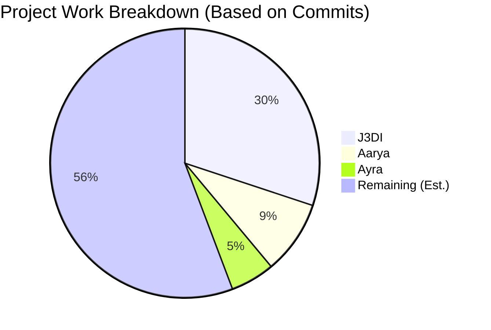

# Team Ownership & Contributions

**Last Updated:** 2026-09-06

This document outlines the agreed project responsibilities and the reviewed contribution history, reconciled with the overall completion report.

> **Note:** The remaining work is an estimate based on the current completion rate (60 out of 136 roadmap items completed across 50 total commits).

## J3DI
**Role:** Project Lead
**Assigned Steps:** 01, 02, 09, 10
**Total Commits:** 34

**Allocated Project-wide Ownership:**
- Documentation, planning, and team coordination
- Merging, review, and integration oversight
- Final polish and repository management

**Verified Contribution Record:**
- **Leadership:** Served as the overall project lead from initiation through completion. Owned implementation planning, work sequencing, roadmap management, and delivery oversight.
- **Foundation & Architecture:** Established the repository, React/Vite frontend, FastAPI backend, SQLite, Ollama configuration, and the entire frontend architecture (dashboards, timelines, graphs, etc.).
- **Integration & Polish:** Coordinated the three-phase integration, dataset-scope corrections, and handled branch synchronization and final documentation.

**Major Commits:**
- `4f00e8f` (2026-09-02): Complete Phase 2 recovery workflows
- `7ecdc12` (2026-09-01): Complete Phase 1 usability workflows
- `d08598e` (2026-08-15): Complete end-to-end investigation integration
- `8e6500c` (2026-07-23): Refine Traceveil investigation frontend
- `72339f4` (2026-07-19): Initialize Sentinel Step 1 foundation

---

## Aarya
**Role:** Contributor
**Assigned Steps:** 03, 04, 06, 08
**Total Commits:** 10

**Verified Contribution Record:**
- **Evidence Validation:** Implemented evidence schemas, profiles, hashing, validation rules, persistence/migrations, dataset fixtures, and live telemetry contracts.
- **Canonical Normalization:** Built versioned canonical events, deterministic IDs, provenance tracking, simulation/network adapters, and integrity checks.
- **Deterministic Analytics:** Implemented analytics filters, sorting, rules, baselines, bounded risk scoring, correlation, incident grouping, and live alerts.

**Major Commits:**
- `77ed34e` (2026-09-01): feat: complete step 8 investigation workflows
- `df03b84` (2026-08-21): feat: integrate step 8 investigation APIs
- `b4d2337` (2026-08-11): Step 6 - Deterministic Analytics
- `72ad28c` (2026-08-07): Step 4 - Canonical Normalization
- `66b43fe` (2026-08-06): Step 3 - Evidence Validation

---

## Ayra
**Role:** Contributor
**Assigned Steps:** 05, 07, 11, 12
**Total Commits:** 6

**Verified Contribution Record:**
- **Step 5 - Live IoT Integration:** Contributed directly to Step 5 (authenticated HTTP intake, sessions, etc.), including subsequent integration fixes and CI/CD corrections.

**Major Commits:**
- `3118068` (2026-09-06): Step5-Ayra
- `8b79d0a` (2026-09-02): Step 5
